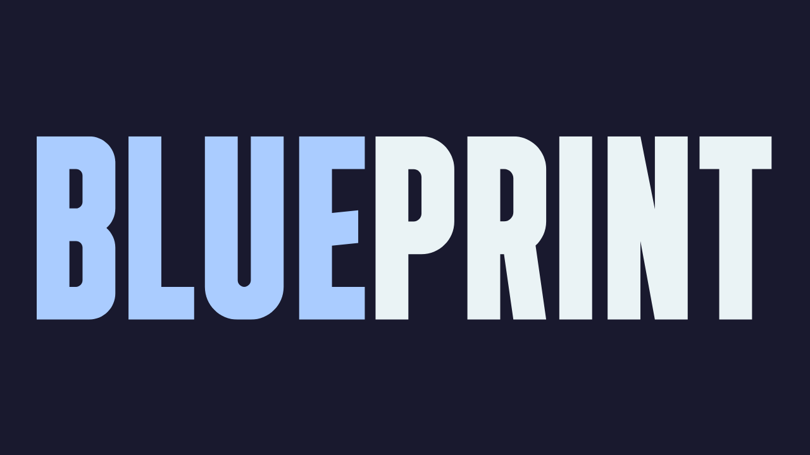

<p align="center">
  <br>
  <a href="https://bp.fun" target="_blank">
    
  </a>
  <br><br>
</p>

[](https://twitter.com/bpdotfun)
[](./LICENSE)

# bp.fun Contracts

This repository contains a suite of upgradeable smart contracts that power the Blueprint ecosystem. The contracts include:

- **BlueprintToken** – An ERC20 token (BP) with burn, permit, and UUPS upgradeability.
- **Incentive** – A reward claim contract that uses EIP‑712 signatures to verify reward claims, enforce a daily reward cap, and trigger reward distribution via a factory.
- **BlueprintStorefront** – A storefront contract that accepts payments (in BP tokens or ETH) for digital/physical items, splitting incoming funds among creator, buyback, and treasury wallets.
- **Treasury** – A flexible, upgradeable treasury contract that holds BP tokens, ETH, and other ERC20 tokens and allows admin withdrawals or donations.

---

## Table of Contents

- [Overview](#overview)
- [Smart Contract Details](#smart-contract-details)
  - [BlueprintToken](#blueprinttoken)
  - [Incentive](#incentive)
  - [BlueprintStorefront](#blueprintstorefront)
  - [Treasury](#treasury)
- [Setup and Installation](#setup-and-installation)
- [Deployment](#deployment)
- [Testing](#testing)
- [Troubleshooting](#troubleshooting)
- [License](#license)

---

## Overview

Blueprint’s smart contract suite enables a storefront for creators with reward claims. The reward claim process is a fork of Layer3's [CUBE](https://github.com/layer3xyz/cubes) contract for reward distribution. The contracts are built with upgradeability (UUPS pattern) and leverage OpenZeppelin’s upgradeable libraries for security and reliability.

---

## Smart Contract Details

### BlueprintToken

- **Purpose:**  
  Upgradeable ERC20 token with burn, permit, and owner-controlled upgrades.
- **Key Features:**
  - Uses UUPS upgradeability.
  - Initial mint of 10 billion tokens sent to a treasury address.
  - Incorporates ERC20Permit for gas-less approvals.
- **File:** [BlueprintToken.sol](./src/BlueprintToken.sol)

---

### Incentive

- **Purpose:**  
  Processes reward claims by verifying EIP‑712–signed claim data and enforcing a 24-hour cooldown per quest.
- **Key Features:**
  - Verifies signature over a `IncentiveData` struct.
  - Emits events for quest initialization, transaction logging, and reward distribution.
  - Integrates with an escrow factory for reward distribution.
- **File:** [Incentive.sol](./src/Incentive.sol)

---

### BlueprintStorefront

- **Purpose:**  
  A storefront to sell items (physical or digital) that accepts BP tokens or ETH. Payments are split among:
  - **Buyback Wallet:** For buyback/liquidity purposes.
  - **Creator Wallet:** Direct to content creator.
  - **Blueprint Wallet:** Treasury.
- **Key Features:**
  - EIP‑712 signature–based purchase authorization.
  - Item management with supply tracking and purchase history.
  - Emergency withdrawal functionality.
- **File:** [BlueprintStorefront.sol](./src/BlueprintStorefront.sol)

---

### Treasury

- **Purpose:**  
  Manages funds (BP tokens, ETH, or any ERC20) with admin-controlled withdrawals and donations.
- **Key Features:**
  - Supports direct ETH or token withdrawals.
  - Uses UUPS upgradeability.
  - Provides donation functionality.
- **File:** [Treasury.sol](./src/Treasury.sol)

---

## Setup and Installation

Ensure you have [Foundry](https://book.getfoundry.sh) installed and updated:

```bash
foundryup
```

## Install

```bash
make install
```

Build the contracts:

```bash
make build
```

---

## Deployment

The contracts are designed for upgradeability and can be deployed using Forge scripts.

```bash
make deploy_proxy ARGS="--network base_sepolia"
make deploy_escrow ARGS="--network base_sepolia"
```

### Verification

For proxy contracts, use this command after deployment (replace addresses with your values):

```bash
forge verify-contract $FACTORY_PROXY_ADDRESS \
  --chain-id 84532 \
  --etherscan-api-key $BASESCAN_API_KEY \
  --constructor-args $(cast abi-encode "constructor(address,bytes)" $FACTORY_IMPLEMENTATION_ADDRESS 0x$(cast sig "initialize(address)" | cut -c3-)$(cast abi-encode "x(address)" $TREASURY_ADDRESS | cut -c3-)) \
  --rpc-url $BASE_SEPOLIA_RPC \
  "lib/openzeppelin-contracts/contracts/proxy/ERC1967/ERC1967Proxy.sol:ERC1967Proxy" \
  --watch
```

Example initialization calldata generation:

```bash
echo "0x$(cast sig "initialize(address)" | cut -c3-)$(cast abi-encode "x(address)" $TREASURY_ADDRESS | cut -c3-)"
```

For local development with Anvil:

```bash
anvil
```

In a new terminal, run:

```bash
forge script script/Anvil.s.sol --rpc-url http://localhost:8545 --private-key <ANVIL_PRIVATE_KEY> --broadcast --via-ir
```

---

## Testing

Run the complete test suite with:

```bash
make test
```

Or directly with Forge:

```bash
forge install
forge test
```

---

## SDK

To generate the SDK ABIs, run the following commands:

```bash
jq '.abi' out/Incentive.sol/Incentive.json > sdk/abis/incentiveAbi.json
jq '.abi' out/Escrow.sol/Escrow.json > sdk/abis/escrowAbi.json
jq '.abi' out/Factory.sol/Factory.json > sdk/abis/factoryAbi.json
jq '.abi' out/BlueprintToken.sol/BlueprintToken.json > sdk/abis/blueprintTokenAbi.json
jq '.abi' out/BlueprintStorefront.sol/BlueprintStorefront.json > sdk/abis/blueprintStorefrontAbi.json
```

## Troubleshooting

- **Foundry Installation Issues:**  
  If you encounter “Permission Denied” errors during `forge install`, ensure your GitHub SSH keys are correctly added. Refer to [GitHub SSH documentation](https://docs.github.com/en/authentication/connecting-to-github-with-ssh).

- **Deployment Failures:**  
  Ensure that the correct flags and salt values are used (especially for CREATE2 deployments) and verify that your deployer address matches the expected CREATE2 proxy address if applicable.

---

## License

This repository is released under the [Apache 2.0 License](./LICENSE). Some files (such as tests and scripts) may be licensed under MIT.
